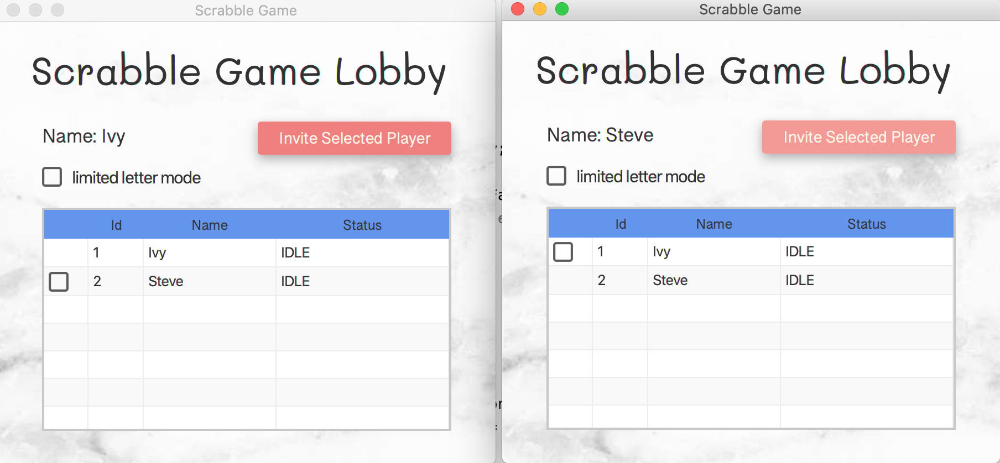
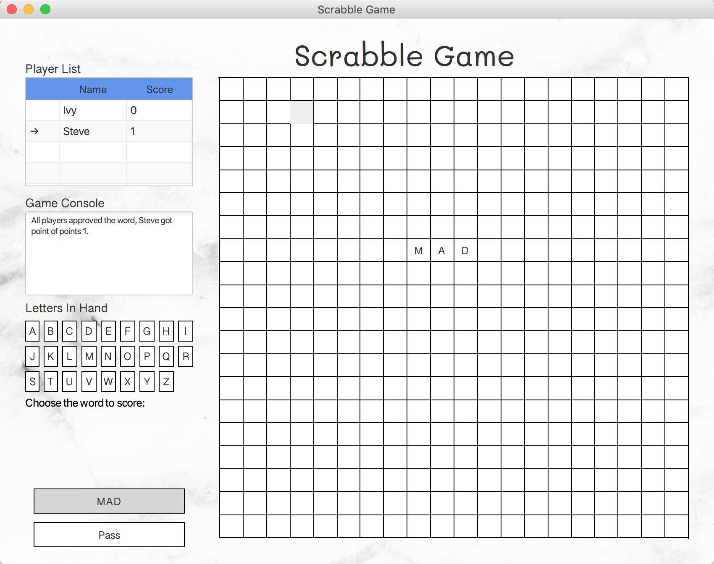
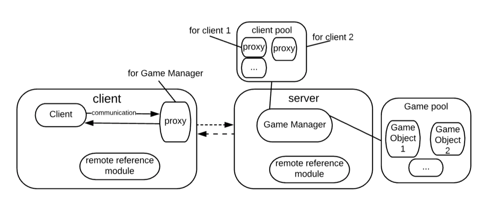

# Scrabble Game

Scrabble game is a multi-player game implemented with `Java RMI` and `JavaFX`.
* RMI game that enable multiple players connect to the game with real-time experience
* Enable multiple players to login to the lobby and invite players to start a new game
* Enable multiple games to run at the same time
* Limited Letter Mode and Basic Mode available  
* One player place a new letter on the board, he will select the potential words, and everyone vote to decide whether it
is a word to allow the player to score. 

## Screenshots

<center>multiple players in lobby</center>


<center>Multi-player Scrabble Game</center>

## jar run
```
# server
java -jar server.jar 

# client to local host
java -jar client.jar

# client to custom host
java -jar client.jar <host>
```

## Architecture

The project is divided as `Server` and `Client`, main class in server side is `src/server/ScrabbleServer`,
which maintains the game pool the player list. Main class of client is `src/MainApp`, which is a `JavaFX` app
with RMI implementation, you should start multiple client processes to test the program. 

## Development Environment
* `java 1.8`
* `maven`


